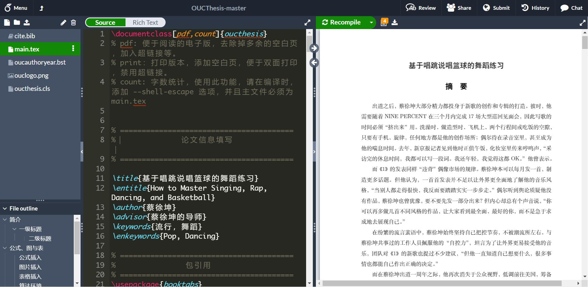

## 中国海洋大学硕博士学位论文 LaTeX 模板（overleaf & Texpage版）

本模板是中国海洋大学硕博士学位论文 LaTeX 模板。LaTeX是一个流行的编辑科学类文章的工具。 大多数科学类书籍，期刊，文章都采用了LaTeX。 使用这个模板可以使你从无聊的格式限制中解脱出来，从而更专注地阐述自己的想法。 希望本模板能够帮助你入门LaTeX, 如果你有关于本模板的良好意见和建议，请在顶栏的问题(issue)一栏中提出。

本项目以 [GeoffreyChen](https://geoch.top) 编写的中国海洋大学的硕博士学位论文 LaTeX 模板为基础，按照最新版的 《[中国海洋大学研究生学位论文书写格式统一要求](http://grad.ouc.edu.cn/39/69/c1660a14697/page.psp)》 的要求编写。

学习LaTeX可以参考 Overleaf 的官方教程（[Learn LaTeX in 30 minutes](https://cn.overleaf.com/learn/latex/Learn_LaTeX_in_30_minutes)），或者在B站学习碗豆老师的45分钟教学视频 “[Latex科研写作入门](https://www.bilibili.com/video/BV1Au411N7Ew/)”。

本模板已经帮助2017级以来的多届中国海洋大学硕士、博士毕业生使用，在学生及答辩专家中反馈良好，大家可以放心使用。

 

## 如何使用

**本模板在 Overleaf 下测试通过，本地编译尚未测试。** 可以通过链接：https://www.overleaf.com/read/jkrpnmrnmqwz   在线浏览本项目。考虑到 overleaf 服务器在国外，有时不太稳定，推荐大家使用国产软件 Texpage，我们组日常使用感觉比 overleaf 流畅许多，地址：https://texpage.com/

Overleaf 是一个线上 LaTeX 编辑器，可以在不安装任何工具的情况下编写 LaTeX 文档，同时也可以和其他人共享文档，共同编辑。

推荐使用 **Overleaf** 使用本模板，具体方法如下：

1. 下载模板代码，并压缩成 .zip 文件
2. 在 Overleaf 中上传这个 .zip 压缩文件以创建一个新 Overleaf 项目
3. 在 Overleaf 界面左上角点击 "Menu"
   - 选择 "Compiler" 为 "XeLaTeX"
   - 选择 "TeX Live version" 为 "2019" 或者更新的版本
4. 使用 Overleaf 编译

最近我也在使用 TexPage （https://www.texpage.com/），可以理解为国产版的 Overleaf，对于国内用户支持的要好一些，尤其是云盘同步功能，支持百度网盘和 WebDAV 。另外，遇到问题客服也很给力，发邮件能够12小时以内及时回复帮忙解决问题，大家可以考虑。

 

## 修改记录

- 20220221，修改参考文献自动连续：[1] [2] [3] 自动转化为 [1-3]
- 20220115，为方便在 Overleaf  中快速编译，将正文拆分为若干单独文件
- 20220501，修改“关键词”格式，小节不换页（赵政达修改）
- 20230126，考虑到图表标题和正文字体一样大，有时区分不开是正文还是图表标题，因此把图表标题改小一号（高峰修改）

## 开源许可

本项目代码基于 MIT 协议开源

学校标志的版权归中国海洋大学所有

有任何问题可以随时联系高老师：gaofeng@ouc.edu.cn

